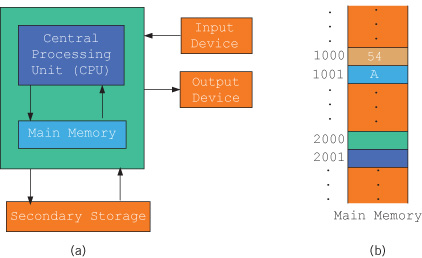

### 1-1 A Brief Overview of the History of Computers

 <h5><u>Abacus</u></h5>

* First device know to carry out calculations.
* Invented in Asia.
* Uses a system of sliding beads ina rack for Addition and subtraction.

 <h5><u>Pascaline</u></h5>

 * Calculation device invented by Blaise Pascal.
 * Calculated sums up to eight figures long.

**Gottfried von Leibniz** 
  
  * Invented a device that was able to add, subtract, multiply and divide. 

**Joseph Jacquard** 

* Discovered that the weaving instructions for his looms could be programmed with cards with holes punched in them.

**Charles Babbage** 

* Designed two calculating machines: the difference engine and analytical engine.
* Difference engine could perform complex operations such as squaring numbers automatically.

First computer-like machine was the Mark I. It was built, in 1944. By IBM and Harvard University Under leadership of **Howard Aiken**.

**FORTRAN** and **COBOL** were two early programming languages.

In 1970, the microprocessor, an entire central processing unit(CPU) on a single chip was invented.

1977, Stephen Wozniak and Steven Jobs designed and built the first Apple computer.

---
### 1-2 Elements of a Computer System

A computer is an electronic device capable of performing commands. Basic commands are **input**(get data), **output**(display result), **storage**, and **performance of arithmetic** and **logical operations**. Two main components are **Hardware** and **Software**

---

### 1-2a Hardware

Major hardware 
* central processing unit (CPU)
* main memory (MM)
* input/output devices
* secondary storage

**Input devices** - keyboard, mouse, and secondary storage
**Output devices** - screen, printer, and secondary storage

---
### Central Processing Unit and Main Memory

**central processing unit** - "brain of a computer
more powerful = faster the computer
Arithmetic and logical operations are carried out inside the CPU

**Figure 1-1** Hardware components of a computer and main memory

Main memory, or random access memory, is connected directly to the CPU. Programs must be loaded into main memory before executed.
